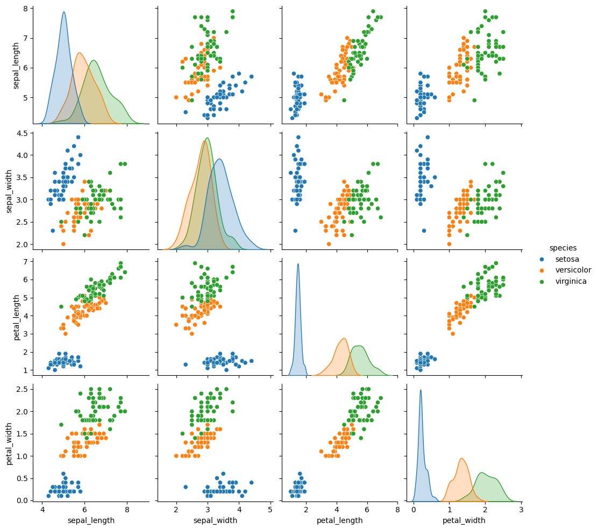

# Logistic Regression: Breast Cancer & Iris Datasets

This repository demonstrates the application of logistic regression for classification tasks using two popular datasets: the **Breast Cancer dataset** and the **Iris dataset**. It provides a complete pipeline, from data preprocessing and exploratory data analysis (EDA) to model training, evaluation, and visualization of results.

---

## **Project Overview**

1. **Breast Cancer Dataset**  
   - **Objective**: Predict whether a tumor is malignant or benign.  
   - **Type**: Binary classification.  
   - **Evaluation Metrics**: Accuracy, precision, recall, F1-score, and ROC-AUC.

2. **Iris Dataset**  
   - **Objective**: Classify iris flowers into three species: Setosa, Versicolor, Virginica.  
   - **Type**: Multi-class classification.  
   - **Evaluation Metrics**: Accuracy and confusion matrix.  
   - **Multi-Class Approach**: One-vs-Rest (OvR) and One-vs-One (OvO) strategies.

---

## **Features**

- Comprehensive data preprocessing, including handling missing values, feature scaling, and encoding.
- Exploratory Data Analysis (EDA) with visualizations for insights into data distributions.
- Application of logistic regression for binary and multi-class classification.
- Model evaluation with performance metrics and visualizations (e.g., ROC curves, confusion matrices).

---

## **Dependencies**

To run the code, make sure you have the following Python libraries installed:

- `pandas`
- `numpy`
- `matplotlib`
- `seaborn`
- `scikit-learn`

## Sample UI

Here’s an example of the application’s interface:

---

## Contact

- **MALLIKARJUN**  
  Data Science
  [GitHub](https://github.com/Mallikarjun-B-Patil) | [LinkedIn](https://www.linkedin.com/in/mallikarjunpatil4472/)
 
